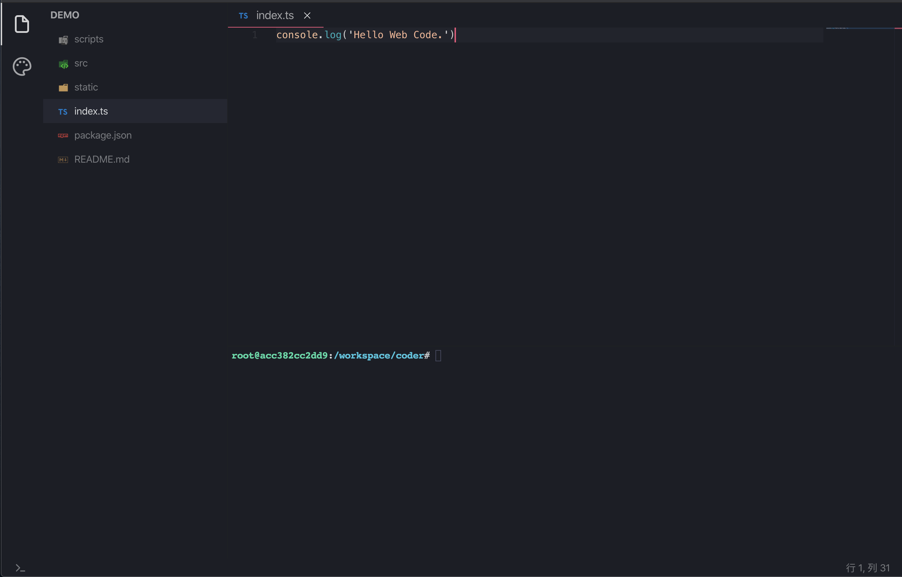

# webcode

## 截图




## 使用方法

### 安装服务端

[详情参照此项目](https://github.com/MANSOUL/webcode-dev/blob/master/README.md)

### 运行本项目

1. `$ npm install`
2. `$ npm start`
3. 浏览器打开 `http://0.0.0.0:7080/project.html`

## 主要功能

- 布局
- 文件树
- 终端
- 编辑器
- 主题
- Restful
- Websocket
- TypeScript + React + Redux

### 布局

经典编辑器布局，主要难点在于加入了两个尺寸控制器，用于控制编辑器、文件树、终端的大小。

### 文件树

主要功能点：

- 展示文件列表
- 控制文件夹的开关闭合
- 使用 material icon 图标
- 重命名文件
- 删除文件
- 创建文件及文件夹
- 文件 Tab 管理

主要难点在于对文件树的修改需要同步 UI 及同步到后端，故此处对项目文件树的管理采用 redux + redux-thunk，减少管理复杂度。

### 终端

终端使用 `xterm` + `websocket` 实时与后端 `terminal` 连接。目前发现的问题是对于中文宽字符的控制出现了问题（待修复）

终端的主要难点其实和整个编辑器的主要难点一致，也就是安全性的控制，安全性的解决方案目前采用 `docker` 容器方式解决。

### 编辑器

采用开源 Monaco 编辑器，目前只实现了简单的编辑功能，还未深入开发，后期打算对此编辑器增强的功能有

- 主题跟随 IDE
- 对项目下的 `eslint`, `prettier`, `editorconfig` 等配置文件进行支持
- 对常用快捷键的支持
- ...

### 主题

主题所使用的样式以 `css in js` 方式进行支持，其内部原理是对 React `context` 和 `hooks` 进行了封装。并且对 vscode 主题进行了兼容。

使用方式如下：

```jsx
import { createStyles } from '@src/theme'

const useStyles = createStyles(theme => ({
  tab: {
    backgroundColor: theme.colors['tab.inactiveBackground']
  }
}))

function ThemeDemo() {
  const classes = useStyles()
  return <div className={classes.tab}>Hello Theme.</div>
}
```

### Restful

`Restful API` 用于对文件树或文件的增删改查操作

### Websocket
